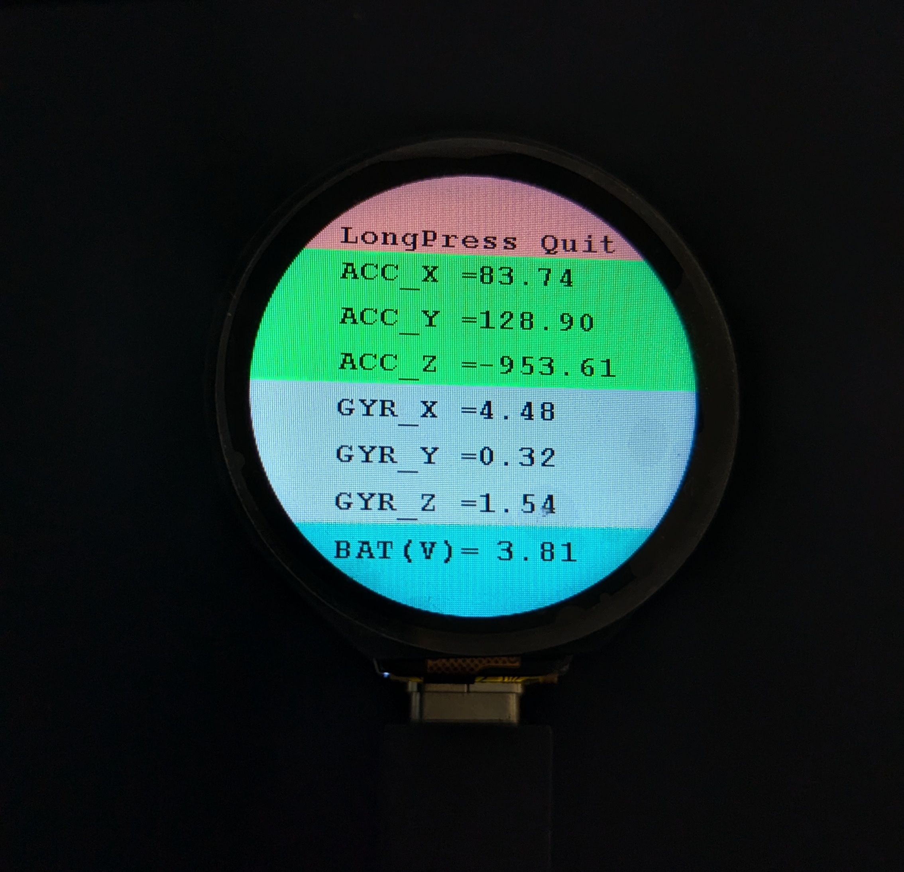

# esp_32_s3_1_28_lcd_test_pio



An example PlatformIO project for the Waveshare [ESP32-S3-Touch-LCD-1.28](https://www.waveshare.com/wiki/ESP32-S3-Touch-LCD-1.28) screen. It is simply the `Sample_demo` Arduino project they provide on the products [wiki](https://www.waveshare.com/wiki/ESP32-S3-Touch-LCD-1.28#Demo) with the necessary PlatformIO configurations to run it.

### PlatformIO Config file
If you don't want/need to clone the project, here is the `platformio.ini`. These values were source from the product wiki. NOTE: As of current testing, it must use version `2.0.12` of the Arduino-ESP32 firmware. 

```ini
; Initially source from: https://github.com/sivar2311/ESP32-S3-PlatformIO-Flash-and-PSRAM-configurations
[env:esp32-s3-devkitc-1]
platform = espressif32
board = esp32-s3-devkitc-1
framework = arduino

board_build.arduino.memory_type = qio_qspi
board_build.flash_mode = qio
board_build.psram_type = qio
board_upload.flash_size = 16MB
board_upload.maximum_size = 16777216
board_build.extra_flags = 
  -DBOARD_HAS_PSRAM
platform_packages = 
    framework-arduinoespressif32 @ https://github.com/espressif/arduino-esp32.git#2.0.12
```